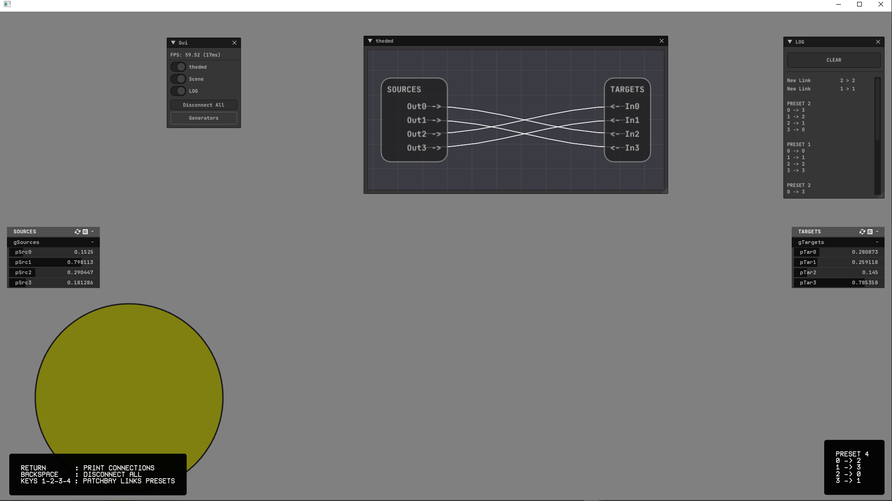

### WIP

- This is an exercise.
- Hardcoded for 4 Sources to 4 Targets.
- Persistent data on exit and restart the app.

## TODO

- Make it layout semi-dynamic:
    - Subscribe ofParams.
- Put inside ofxSurfingOsc.

## Dependencies
- ofxPatchbay
- ofxSurfingImGui
- ofxSurfinghelpers